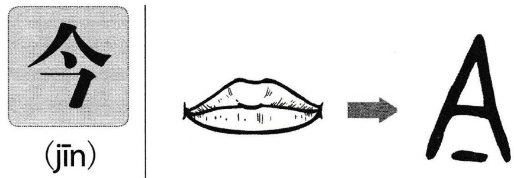

# 今

## Phát âm
* Hán Việt: kim
* Hán Việt: PinYin: jīn
* Nhật: いま (ima)

## Nghĩa
* nay, đương kim
* bây giờ

## Hình ảnh
* 
* 

## Ghi chú
* chữ này nguồn có nghĩa: đang ngậm thứ gì đó trong miệng

## Cấu trúc
* 今 = [人](人.md) [丶](丶.md) [乛](乛.md)

