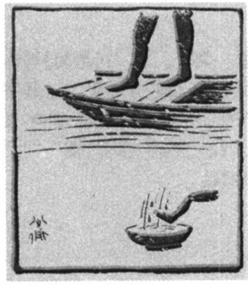
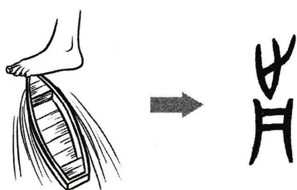

# 前

# Phát âm
* Hán Việt: tiền
* PinYin: qián
* Nhật: ぜん (zen)

# Nghĩa
* 前 = [䒑](䒑.md)  [刀](刀.md)
* 䒑 = [艸](艸.md)
* (thảo)
* tiền (trước)

# Hình ảnh
+ 
+ 

# Chú giải月
+ trong văn tự gốc, từ này chỉ bàn chân đứng trước mũi thuyền sẽ làm thuyền tiến lên
+ tức là tiền tuyến, tiên phong (đứng trước)
+ xét về bộ thủ: cầm đao (刀) đứng đầu (䒑) thuyền (月)

