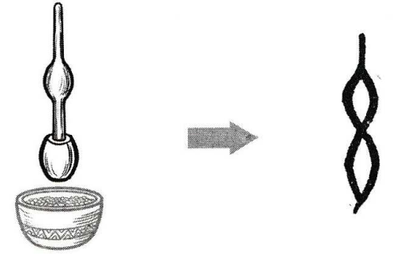

# 午

# Nghĩa
* 午 = [丿](丿.md) [干](干.md)
* (n) buổi trưa
* Ngôi thứ 7 trong địa chi (12 con giáp)

# Phát âm
* Hán Việt: /ngọ/
* PinYin: wǔ
* Nhật: ゴ (go)

# Hình ảnh

# Chú giải
+ đây là cái chày
+ buổi trưa người ta thường dùng chày giã gạo nấu ăn

