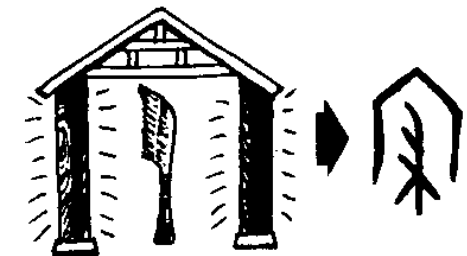

# 寝

## Phát âm
* Hán Việt: tẩm
* Hán Việt: PinYin: qǐn
* Nhật: ね (ne)

## Nghĩa
* ngủ
* lăng mộ

## Hình ảnh
* 

## Ghi chú
* một căn phòng được quét dọn sạch sẽ để "ngủ"

## Cấu trúc
* 寝 = [宀](宀.md) [丬](丬.md) [彐](彐.md) [冖](冖.md) [又](又.md)

