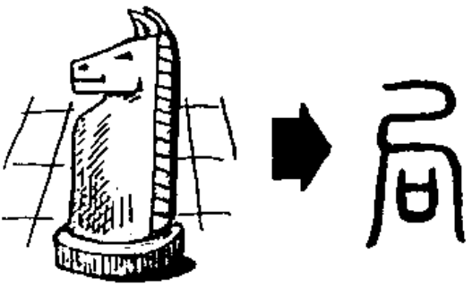

# 局

# Phát âm
* Hán Việt: cục
* PinYin: jú 
* Nhật: キョク (kyoku)

# Nghĩa
* 局 = [尸](尸.md) [口](口.md)
* (n) bộ phận

# Hình ảnh

# Chú giải
+ cục nghĩa gốc là bàn cờ
+ trong Tống thư ghi là Thái Tổ Hoàng ban cho cục tử (quân cờ), trong đó chữ khẩu là bàn cờ

