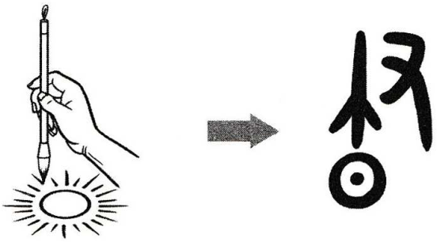

# 昼

## Cấu trúc
* 昼 = [尺](尺.md) [旦](旦.md)

## Phát âm

* Hán Việt: Hán Việt: trú
* PinYin: zhòu
* Nhật: ひる (hiru)

## Nghĩa

* trú, ban ngày

## Hình ảnh

## Ghi chú
* chữ gốc bên trên sẽ là chữ duật, nghĩa là nét bút
* bên dưới là nhật nghĩa là ban ngày
* ban ngày mới nhìn thấy để viết

