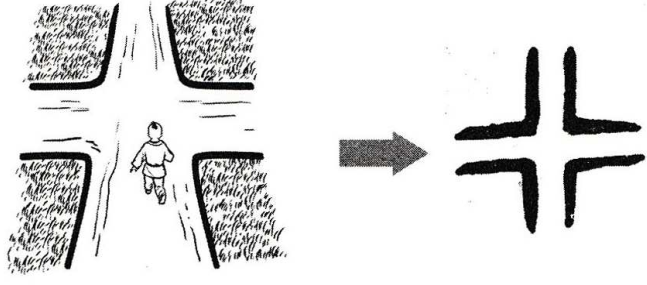

# 行

## Phát âm
* Hán Việt: hành
* Hán Việt: PinYin: xíng
* Nhật: コウ (kō)

## Nghĩa
* (bộ) Hành (đi, vi hành)
* hàng: dòng
* hành: vận hành
* hạng: thứ hạng
* hạnh: đức hạnh

## Hình ảnh
* 

## Ghi chú
* chữ hành gốc là "hàng", nghĩa là 1 ngã tư

## Tags
* bộ thủ 6 nét

## Cấu trúc
* 行 = [彳](彳.md) [亍](亍.md)

