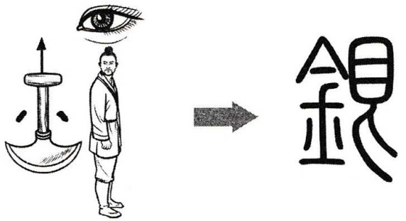

# 銀

* Phát âm
* Hán Việt: ngân
* PinYin: yín
* Nhật: ギン (gin)

# Nghĩa
* 銀 = [金](金.md) [艮](艮.md)
* bạc

# Hình ảnh

# Chú giải
+ bên trái là bộ kim chỉ kim loại
+ bên phải trước đây là chữ lương nghĩa là trừng mắt nhìn nhau
+ ý nói: vàng bạc là kim loại quý, ai cũng phải trố mắt ra nhìn
+ một cách nhớ nữa: kim cấn => ngân

