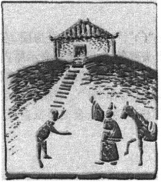

# 館

# Phát âm
* Hán Việt: quản
* PinYin: guǎn
* Nhật: カン (kan)

# Nghĩa
+ 館 = [食](食.md) [官](官.md)
+ nhà ở, nơi ở, quán trọ

# Hình ảnh

# Chú giải
+ mượn hình của chữ quan, bên trái là bộ thực nghĩa là ăn uống
+ tựu chung lại là quán trọ, vừa ở vừa ăn uống

